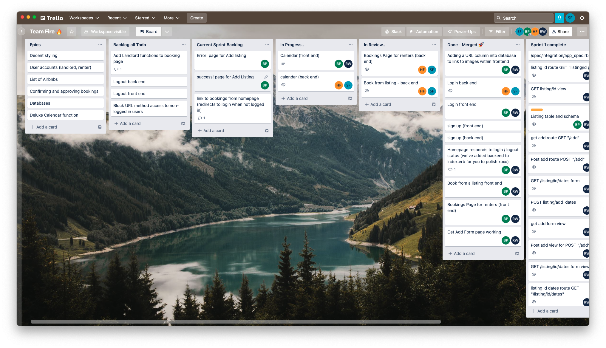

# MakersBnB

## Team Fire 🔥

Our team challenge was to develop a BnB application over the period of 1 week starting with a Ruby / Sinatra framework.

We used notion to capture the [project specification](design/team-fire-spec.md) and create [user stories](design/user-stories.md). We developed the application using agile methodology and used Trello for our tickets.



## Get Started

### Install

```bash
# Install gems
bundle install

# Install postgresql.
$ brew install postgresql

# (...)

# Run this after the installation
# to start the postgresql software
# in the background.
$ brew services start postgresql

# You should get the following output:
==> Successfully started `postgresql` (label: homebrew.mxcl.postgresql)
```

### Run

This application uses rack as its server.

```bash
# Run the server (better to do this in a separate terminal).
rackup
```

Now go to **http://localhost:9292/** in your web browser

### Testing

User Rspec to run unit tests and integration tests as used during development.

```bash
# Run the tests
rspec
```

## Tech

* Ruby
* Sinatra
* PostgreSQL
* BCrypt
* Rack
* Rspec
